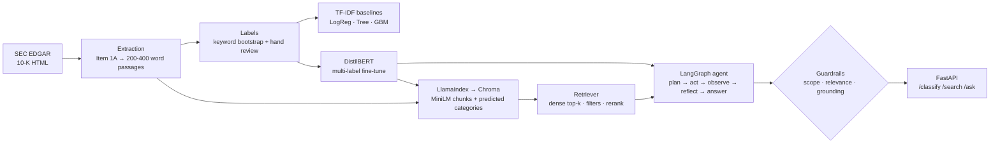

# Risk Intelligence

A system that reads the **Item 1A "Risk Factors"** sections of public companies'
10-K filings from SEC EDGAR and answers one question: *what risks does this company
(or sector) say it faces, and where exactly does it say so?* It sorts each passage
into six risk categories (credit, market, operational, regulatory, cyber, climate)
using a TF-IDF baseline and a fine-tuned DistilBERT, compared on the same test split.
It indexes the passages in Chroma via LlamaIndex, and a LangGraph agent answers
questions with verbatim, `passage_id`-cited quotes. When it can't ground an answer,
it **refuses**.

> **Status:** built and run end to end on real SEC filings (pipeline run 8): 36 10-Ks
> fetched for 12 companies, 33 extracted (8% failure rate, all Wells Fargo), 1,382
> passages, 3,183 indexed chunks. Every number below is copied from
> [RESULTS.md](RESULTS.md), which the measuring code writes. The labels are still
> keyword-generated, not hand-corrected; see the caveats under Results.

## Architecture



| Module | Role |
|---|---|
| `src/ingest/edgar.py` | Most recent 10-Ks per company. SEC User-Agent, 150 ms throttle, 3 retries |
| `src/ingest/extract.py` | Isolates Item 1A while rejecting TOC matches, packs passages, logs every failure |
| `src/nlp/` | Keyword label bootstrap, TF-IDF preprocessing, three classical baselines, LSA clustering |
| `src/models/` | DistilBERT fine-tune, shared metrics, one classifier interface with a baseline fallback |
| `src/rag/` | Chroma index, retriever with filters and reranking, hit-rate/MRR evaluation |
| `src/agent/` | Three tools, the LangGraph state machine, guardrails |
| `src/api/main.py` | FastAPI with Pydantic models throughout. Docs at `/docs` |
| `src/results.py` | The only way numbers reach `RESULTS.md` |

## Results

All numbers live in [RESULTS.md](RESULTS.md), generated from `results.json` by the
code that measured them. Figures are written to `notebooks/` by `python -m src.report`
and shown in `notebooks/analysis.ipynb`.

### Data

| | |
|---|---|
| 10-K filings fetched / extracted | 36 / 33 (failure rate 8.3%: all three Wells Fargo filings, whose 10-K only cross-references its Annual Report) |
| Companies / sectors | 11 / 3 (banking, energy, technology) |
| Risk-factor passages | 1,382 (200–400 words, split on paragraph boundaries) |
| Labelled passages | 300 (240 train / 60 test, fixed seed-42 split); **all keyword-generated, 0 hand-corrected** |
| Positives per category | regulatory 130, climate 93, operational 73, cyber 63, market 50, credit 35 |

### Classification: baseline vs transformer (same 60-passage test split)

| Model | macro-F1 | micro-F1 | subset accuracy | train time (CPU) |
|---|---|---|---|---|
| TF-IDF + gradient boosting | **0.810** | 0.845 | 0.633 | 7.6 s |
| TF-IDF + logistic regression | 0.789 | 0.805 | 0.633 | 0.1 s |
| TF-IDF + decision tree | 0.572 | 0.654 | 0.400 | 0.1 s |
| DistilBERT (fine-tuned) | 0.609 | 0.609 | 0.233 | 359 s, 269 MB, 132 ms/passage |

Per-class F1, best baseline vs DistilBERT:

| Class | Gradient boosting | DistilBERT | Δ | Test positives |
|---|---|---|---|---|
| climate | 0.897 | 0.750 | −0.147 | 16 |
| credit | 0.667 | 0.632 | −0.035 | 7 |
| cyber | 0.909 | 0.540 | −0.369 | 12 |
| market | 0.667 | 0.600 | −0.067 | 9 |
| operational | 0.815 | 0.500 | −0.315 | 16 |
| regulatory | 0.906 | 0.633 | −0.272 | 27 |

**The baseline beats DistilBERT on every class.** Two reasons, both visible in the
numbers, and neither is "transformers are worse at this":

1. **The labels are keyword-generated.** TF-IDF can nearly re-learn the labelling
   rules: its top cyber features are *cybersecurity, security, systems, attacks*, the
   rule's own vocabulary. The comparison partly measures who copies the labeller
   best. Hand-corrected labels are needed for a fair test of semantic understanding.
2. **DistilBERT is undertrained at the spec's fixed budget.** 3 epochs × 240 passages
   at batch 8 is 90 optimiser steps. Its probabilities cluster near 0.5 (mean P per
   class 0.41–0.51), and it over-predicts: e.g. operational is predicted for 47% of
   test passages against a true rate of 27%. The first run without positive-class
   weighting collapsed to predicting nothing (macro-F1 ≈ 0.02); see DECISIONS.md.

Also note that 60 test passages is small: credit has 7 positives, so one passage moves
its F1 by roughly 0.1.

### Unsupervised: TF-IDF → SVD(100) → KMeans(k=6)

Silhouette 0.04 (weak separation); SVD keeps 27.5% of variance. The clusters
partly match risk types (a cross-sector **cyber** cluster, 30/31 labelled passages
cyber; an energy **climate/oil & gas** cluster; a bank **rates/credit/liquidity**
cluster). Two clusters track the *issuer* instead (one JPMorgan, one Citi),
because each bank's boilerplate dominates its vocabulary. The same effect shows up in
the classifier, where `jpmorganchase` is a top credit feature.

### Retrieval (19 of 20 hand-written questions; the Wells Fargo one can't resolve)

| | hit@1 | hit@3 | hit@5 | hit@8 | MRR@8 |
|---|---|---|---|---|---|
| Dense only (MiniLM, Chroma) | 0.842 | 0.947 | 0.947 | 1.000 | 0.894 |
| Dense + lexical rerank | **0.895** | **1.000** | 1.000 | 1.000 | **0.947** |

Reranking (0.7·dense + 0.3·idf-weighted query-term coverage) fixes one rank-1 miss
and pulls every expected passage into the top 3. Expected passages come from rules
(ticker + required terms) resolved against the corpus, not hand-picked IDs. With 19 questions, each one is ~0.05
of hit rate, so treat the gap as indicative, not significant.

### Agent

| | |
|---|---|
| Adversarial questions refused | **10 / 10** (4 speculation, 3 after filing date, 3 company not in corpus) |
| Demo questions answered | 5 / 5; 4 with passage-cited verbatim quotes, 1 classifier answer (nothing to cite) |
| Planner | rule-based (no OpenAI key); LLM path implemented, not exercised |

## Design notes

**Why TF-IDF before a transformer.** A linear model on TF-IDF n-grams trains in
seconds and can be read: its top-weighted features per class show what signal the
labels carry. If LogReg already reaches high F1 on a category whose vocabulary is
distinctive (cyber: *ransomware, unauthorized access*), DistilBERT's extra cost has
to be justified by the categories where meaning matters more than keywords
(operational vs regulatory). Without the baseline there's no way to tell whether
the transformer adds anything.

**Why multi-label, not multi-class.** Risk factors overlap: a data breach that leads
to an enforcement action is cyber *and* regulatory. Multi-class softmax makes
the six probabilities compete and sum to 1, so a confident "cyber" pushes
"regulatory" down even when both hold. The model uses
`problem_type="multi_label_classification"`, i.e. `BCEWithLogitsLoss` with an
independent sigmoid per class, and a test asserts probabilities can sum above 1.

**Why retrieval metrics, not vibes.** The agent can only be as right as what it
retrieves. Twenty questions with known expected passages give hit rate@k (did a
relevant passage show up at all?) and MRR (how high?). That is how to tell whether
the reranker, the chunk size or the embedding model actually helps. Both metrics
ignore everything after the first relevant hit and say nothing about whether the
*answer* is right. The grounding guardrail covers that part.

**Why the agent refuses rather than guesses.** In a risk context a fluent wrong
answer costs more than "I can't tell from these filings". The agent refuses at three
points:
1. **Scope:** unknown company, post-filing-date question, or a request for speculation.
2. **Relevance:** the best passage scores below the floor.
3. **Grounding:** a sentence lacks a citation, cites a passage that wasn't retrieved,
   quotes text the passage doesn't contain, or doesn't address the question.

Every answer sentence carries `[passage_id]`.

## Sample transcripts

From the real corpus (pipeline run 8). The full transcripts are in
`data/eval/demo_transcript.md` and `data/eval/adversarial_transcript.md`.

```
Q: What interest rate risks do banks in the corpus describe?
A: Bank of America Corp (2025 10-K) states: "Monetary policy has contributed to and
   may continue to result in elevated market interest rates and a flat and/or inverted
   yield curve." [BAC-2025-002] ...
Citations: BAC-2025-002, BAC-2024-004, BAC-2024-002
Trace:
  - plan (rule-based): intent=search; calls=search_risk_disclosures(query=..., sector='banking')
  - act: search_risk_disclosures(query=..., sector='banking')
  - observe: 8 passages, best 0.798 (BAC-2025-002, Bank of America Corp)
  - reflect: evidence gathered → answer
  - answer: grounded, 3 citation(s)
```

```
Q: How does Goldman Sachs describe its cybersecurity risk?
A: I can't answer this from the corpus. company_not_in_corpus: 'Goldman Sachs' is not
   one of the companies in the corpus (AAPL, BAC, C, COP, CVX, JPM, MSFT, NVDA, ORCL,
   SLB, XOM). I won't answer from general knowledge because I can't cite it.
Trace:
  - plan: scope guardrail refused (company_not_in_corpus)
```

```
Q: Which bank in the corpus is most likely to fail in the next recession?
A: I can't answer this from the corpus. speculation: This asks for a prediction or
   investment advice. Risk-factor disclosures describe what could go wrong; they do
   not support forecasts of prices or outcomes.
Trace:
  - plan: scope guardrail refused (speculation)
```

A visible weakness: the extractive composer can quote a mid-sentence clause (one
Chevron climate quote starts "and epidemic or pandemic diseases, …"). It is verbatim
and grounded, but reads poorly. An LLM composer, or sentence-level reranking, would fix it.

## How to run

```bash
python3.11 -m venv .venv && .venv/bin/pip install -r requirements.txt
cp .env.example .env            # set SEC_CONTACT_EMAIL; optionally OPENAI_API_KEY

./run_pipeline.sh               # ingest → label bootstrap, then stops for hand review
#   hand-correct data/labels/labels.csv (label_source=hand), then:
./run_pipeline.sh 2             # baselines, clustering, DistilBERT, index, retrieval eval, agent

.venv/bin/uvicorn src.api.main:app --port 8080   # http://localhost:8080/docs
```

With Docker (the API plus a Chroma server; models and processed data mounted from the host):

```bash
docker compose up -d --build
docker compose run --rm api python -m src.rag.index    # build the index inside Chroma
curl localhost:8080/health
curl -X POST localhost:8080/ask -H 'content-type: application/json' \
     -d '{"question": "What does Exxon Mobil say about climate regulation?"}'
```

Tests and lint (offline: hashing embeddings, no model downloads, no EDGAR):

```bash
.venv/bin/ruff check . && .venv/bin/pytest -q
```

## What I'd do next

These are the honest limitations:

- **Hand-correct the 300 labels** (currently 0 corrected). This is the single biggest
  improvement: it turns the baseline-vs-DistilBERT comparison from "who copies the
  keyword labeller" into a real test. Then add a validation split to tune
  thresholds and give confidence intervals.
- **Wells Fargo** (3 filings) still fails: its 10-K only cross-references the Annual
  Report exhibit, which the fetcher hasn't located yet.
- **DistilBERT at the spec's 90 steps is undertrained.** More epochs on hand-corrected
  labels, early-stopped on a validation split, is the fair comparison.
- **Lexical grounding** can't see negation. A paraphrase that flips meaning while
  reusing the passage's words would pass. Verbatim quoting is the current
  mitigation; NLI entailment is the fix.
- **The unknown-company check is a capitalisation heuristic**, not NER.
- **Retrieval ground truth is rule-defined** (ticker + required terms) until each item
  is pinned to hand-checked passage ids.
- **No year awareness:** three filings per company means near-duplicate passages
  across years compete in retrieval.
- **For production in a bank:** access control and audit logging per query, PII and
  MNPI handling, model and data versioning with lineage, drift monitoring on both
  classifiers, human review of refusals and answers, a red-team adversarial suite in
  CI, latency SLOs, and a model risk management (SR 11-7) validation package.
