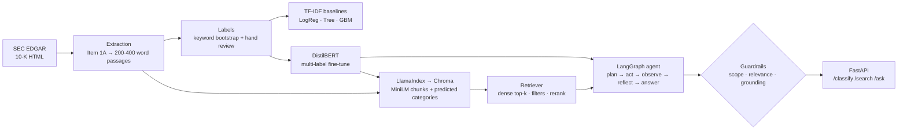

# Risk Intelligence

A system that reads the **Item 1A "Risk Factors"** sections of public companies'
10-K filings from SEC EDGAR and answers one question: *what risks does this company
(or sector) say it faces, and where exactly does it say so?* It sorts each passage
into six risk categories (credit, market, operational, regulatory, cyber, climate)
using a TF-IDF baseline and a fine-tuned DistilBERT, compared on the same test split.
It indexes the passages in Chroma via LlamaIndex, and a LangGraph agent answers
questions with verbatim, `passage_id`-cited quotes. When it can't ground an answer,
it **refuses**.

> **Status:** all code, tests (37, offline), CI and Docker are in place. The data
> phases (EDGAR download, labelling, training, retrieval and agent evaluation) have
> **not been run yet**. The build environment's network blocks `sec.gov` and
> `huggingface.co`. RESULTS.md therefore reads "Not yet measured" everywhere. No
> number in this repository is invented. Run `./run_pipeline.sh` with network access
> to produce them.

## Architecture



| Module | Role |
|---|---|
| `src/ingest/edgar.py` | Most recent 10-Ks per company. SEC User-Agent, 150 ms throttle, 3 retries |
| `src/ingest/extract.py` | Isolates Item 1A while rejecting TOC matches, packs passages, logs every failure |
| `src/nlp/` | Keyword label bootstrap, TF-IDF preprocessing, three classical baselines, LSA clustering |
| `src/models/` | DistilBERT fine-tune, shared metrics, one classifier interface with a baseline fallback |
| `src/rag/` | Chroma index, retriever with filters and reranking, hit-rate/MRR evaluation |
| `src/agent/` | Three tools, the LangGraph state machine, guardrails |
| `src/api/main.py` | FastAPI with Pydantic models throughout. Docs at `/docs` |
| `src/results.py` | The only way numbers reach `RESULTS.md` |

## Results

All numbers live in [RESULTS.md](RESULTS.md), generated from `results.json` by the
code that measured them. Figures are written to `notebooks/` by `python -m src.report`
and shown in `notebooks/analysis.ipynb`.

| Measurement | Where |
|---|---|
| Per-class P/R/F1, macro-F1: LogReg, Decision Tree, Gradient Boosting | RESULTS.md → *Classical baselines* |
| Same metrics for DistilBERT, plus training time, model size, CPU latency | RESULTS.md → *DistilBERT fine-tune* |
| Per-class winner, **including classes where the baseline wins** | RESULTS.md → *Baseline vs transformer* (`classes_where_baseline_wins`) |
| Hit rate and MRR @1/3/5/8, dense vs dense+rerank | RESULTS.md → *Retrieval evaluation* |
| Refusal rate on 10 adversarial questions | RESULTS.md → *Agent* |
| Cluster top terms, sector mix, dominant label | RESULTS.md → *Unsupervised analysis* |

_The tables above get their values when the pipeline runs. This README will quote
them, with the honest per-class finding, once they exist._

## Design notes

**Why TF-IDF before a transformer.** A linear model on TF-IDF n-grams trains in
seconds and can be read: its top-weighted features per class show what signal the
labels carry. If LogReg already reaches high F1 on a category whose vocabulary is
distinctive (cyber: *ransomware, unauthorized access*), DistilBERT's extra cost has
to be justified by the categories where meaning matters more than keywords
(operational vs regulatory). Without the baseline there's no way to tell whether
the transformer adds anything.

**Why multi-label, not multi-class.** Risk factors overlap: a data breach that leads
to an enforcement action is cyber *and* regulatory. Multi-class softmax makes
the six probabilities compete and sum to 1, so a confident "cyber" pushes
"regulatory" down even when both hold. The model uses
`problem_type="multi_label_classification"`, i.e. `BCEWithLogitsLoss` with an
independent sigmoid per class, and a test asserts probabilities can sum above 1.

**Why retrieval metrics, not vibes.** The agent can only be as right as what it
retrieves. Twenty questions with known expected passages give hit rate@k (did a
relevant passage show up at all?) and MRR (how high?). That is how to tell whether
the reranker, the chunk size or the embedding model actually helps. Both metrics
ignore everything after the first relevant hit and say nothing about whether the
*answer* is right. The grounding guardrail covers that part.

**Why the agent refuses rather than guesses.** In a risk context a fluent wrong
answer costs more than "I can't tell from these filings". The agent refuses at three
points:
1. **Scope:** unknown company, post-filing-date question, or a request for speculation.
2. **Relevance:** the best passage scores below the floor.
3. **Grounding:** a sentence lacks a citation, cites a passage that wasn't retrieved,
   quotes text the passage doesn't contain, or doesn't address the question.

Every answer sentence carries `[passage_id]`.

## Sample transcripts

The transcripts below come from the **synthetic offline test corpus** in
`tests/fixtures/` (invented text, not real filings), so they show the mechanics only.
Transcripts on the real corpus are written to `data/eval/demo_transcript.md` and
`data/eval/adversarial_transcript.md` by `python -m src.agent.graph --demo --adversarial`.

```
Q: What does JPMorgan say about cybersecurity risk?
A: JPMorgan Chase & Co. (2024 10-K) states: "Cyberattacks could compromise the
   security of our information systems." [JPM-2024-004]
Trace:
  - plan (rule-based): intent=search; calls=search_risk_disclosures(query=..., company='JPM')
  - act: search_risk_disclosures(query=..., company='JPM')
  - observe: 8 passages, best ... (JPM-2024-004, JPMorgan Chase & Co.)
  - reflect: evidence gathered → answer
  - answer: grounded, 1 citation(s)

Q: Which bank in the corpus is most likely to fail in the next recession?
A: I can't answer this from the corpus. speculation: This asks for a prediction or
   investment advice. Risk-factor disclosures describe what could go wrong; they do
   not support forecasts of prices or outcomes.
Trace:
  - plan: scope guardrail refused (speculation)

Q: What does Apple say about deep-sea mining permits?
A: I can't answer this from the corpus. insufficient_evidence: the retrieved passages
   do not contain a statement that answers the question.
```

## How to run

```bash
python3.11 -m venv .venv && .venv/bin/pip install -r requirements.txt
cp .env.example .env            # set SEC_CONTACT_EMAIL; optionally OPENAI_API_KEY

./run_pipeline.sh               # ingest → label bootstrap, then stops for hand review
#   hand-correct data/labels/labels.csv (label_source=hand), then:
./run_pipeline.sh 2             # baselines, clustering, DistilBERT, index, retrieval eval, agent

.venv/bin/uvicorn src.api.main:app --port 8080   # http://localhost:8080/docs
```

With Docker (the API plus a Chroma server; models and processed data mounted from the host):

```bash
docker compose up -d --build
docker compose run --rm api python -m src.rag.index    # build the index inside Chroma
curl localhost:8080/health
curl -X POST localhost:8080/ask -H 'content-type: application/json' \
     -d '{"question": "What does Exxon Mobil say about climate regulation?"}'
```

Tests and lint (offline: hashing embeddings, no model downloads, no EDGAR):

```bash
.venv/bin/ruff check . && .venv/bin/pytest -q
```

## What I'd do next

These are the honest limitations:

- **300 labels, of which the hand-corrected share is reported**: enough to compare
  models, too few to tune thresholds or give tight confidence intervals.
- **Lexical grounding** can't see negation. A paraphrase that flips meaning while
  reusing the passage's words would pass. Verbatim quoting is the current
  mitigation; NLI entailment is the fix.
- **The unknown-company check is a capitalisation heuristic**, not NER.
- **Retrieval ground truth is rule-defined** (ticker + required terms) until each item
  is pinned to hand-checked passage ids.
- **No year awareness:** three filings per company means near-duplicate passages
  across years compete in retrieval.
- **For production in a bank:** access control and audit logging per query, PII and
  MNPI handling, model and data versioning with lineage, drift monitoring on both
  classifiers, human review of refusals and answers, a red-team adversarial suite in
  CI, latency SLOs, and a model risk management (SR 11-7) validation package.
